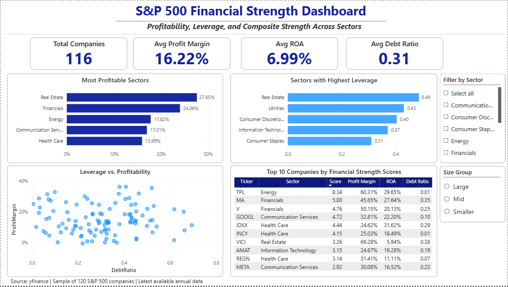

## S&P500-Financial-Strength-Dashboard
An interactive financial analytics project that compares profitability, leverage, and overall financial strength across a sample of S&P 500 companies.

## Overview
This project analyzes a reproducible random sample of 120 S&P 500 companies using financial statement data and market data.  
The goal was to evaluate firm-level and sector-level financial performance by calculating key ratios such as Profit Margin, ROA, and Debt Ratio, and then integrating them into a composite Financial Strength Score.

The final output is an interactive Power BI dashboard that highlights:
- sector-level profitability
- sector-level leverage
- firm-level leverage vs. profitability relationships
- top-ranked companies based on a custom financial strength score

## Project Objective
The purpose of this project was to combine finance knowledge with data analytics skills by:
- collecting and cleaning financial data with Python
- calculating key financial ratios
- building a composite scoring framework for firm comparison
- designing a business-oriented dashboard in Power BI

## Data Source and Scope
- S&P 500 company list: Wikipedia
- Financial and market data: yfinance
- Sample size: 120 companies selected using reproducible random sampling (`random_state=42`)
- Final analysis dataset: 116 companies after cleaning and outlier treatment

This project uses a manageable sample rather than all 500 firms in order to improve data quality, reduce noise, and create a cleaner comparison across sectors.

## Tools and Technologies
- Python
- pandas
- numpy
- yfinance
- Power BI

## Key Financial Metrics
### Profit Margin
Measures how efficiently a firm converts revenue into net income.

**Formula:**  
`Profit Margin = Net Income / Revenue`

### ROA (Return on Assets)
Measures how effectively a firm generates earnings from its asset base.

**Formula:**  
`ROA = Net Income / Total Assets`

### Debt Ratio
Measures how much of a firm’s assets are financed through debt.

**Formula:**  
`Debt Ratio = Total Debt / Total Assets`

### Financial Strength Score
A custom composite score designed to compare firms using three core dimensions:

- higher profitability is better
- higher ROA is better
- lower debt ratio is better

Standardized values were used to combine these variables into a single ranking measure.

## Methodology
1. Retrieved the S&P 500 company list from Wikipedia  
2. Randomly sampled 120 companies using a fixed random seed  
3. Collected company financial data using 'yfinance'  
4. Extracted financial statement items including revenue, net income, total assets, and total debt  
5. Calculated financial ratios such as Profit Margin, ROA, Debt Ratio, and Earnings Yield  
6. Cleaned the dataset and removed extreme outliers  
7. Created a composite Financial Strength Score using standardized ratio values  
8. Built an interactive Power BI dashboard for visualization and comparison

## Dashboard Components
The dashboard includes:

- **KPI cards** for total companies, average profit margin, average ROA, and average debt ratio
- **Sector comparison charts** for profitability and leverage
- **Scatter plot** showing leverage vs. profitability
- **Top 10 table** ranking companies by Financial Strength Score
- **Interactive slicers** for Sector and Size Group filtering

## Key Insights
- Profitability varies meaningfully across sectors, suggesting differences in business model efficiency and pricing power.
- Higher leverage does not necessarily correspond to higher profitability across firms.
- Some companies achieve strong financial performance while maintaining relatively lower debt dependence.
- The Financial Strength Score helps identify firms with balanced financial profiles rather than simply high earnings alone.


## File Structure
```text
sp500-financial-strength-dashboard/
│
├── data/
│   ├── sp500_Compositescore.csv
│   ├── sector_summary.csv
│   └── top_financial_strength.csv
│
├── dashboard/
│   ├── sp500_financial_strength_dashboard.pbix
│   └── sp500_dashboard_final.png
│
├── scripts/
│   ├── sp500_data_collection.py
│   └── sp500_analysis.py
│
└── README.md
```

##Dashboard Preview

